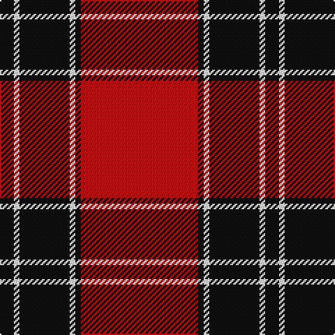

The parent of this is [Forget Family (Red)](/tartans/k/10/w4/k36/w4/k4/r/84/)

This was sourced from register-of-tartans.  It is a [6 stripes tartan](/stripes/stripes6/).

Original link https://www.tartanregister.gov.uk/tartanDetails.aspx?ref=11623

## Thread count
K/10 W4 K36 W4 K4 R/84

## Palette
Each colour and its ΔE from the base-6 reference it is a variant of.

| Colour | Shade | Base | ΔE (OKLab) |
|---|---|---|---|
| K |  `#101010` | K  | 0.17 |
| R |  `#C80000` | R  | 0.00 |
| W |  `#FFFFFF` | W  | 0.03 |

# Sample pattern

ID: /variants/k/10/w4/k36/w4/k4/r/84-k101010-rc80000-wffffff/
