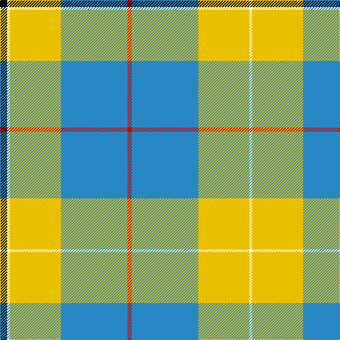

The parent of this is [Cornish National Day](/tartans/k/10/w4/y72/b94/r6/b94/y72/w/4/)

This was sourced from register-of-tartans.  It is a [8 stripes tartan](/stripes/stripes8/).

Original link https://www.tartanregister.gov.uk/tartanDetails.aspx?ref=768

## Thread count
K/10 W4 Y72 B94 R6 B94 Y72 W/4

## Palette
Each colour and its ΔE from the base-6 reference it is a variant of.

| Colour | Shade | Base | ΔE (OKLab) |
|---|---|---|---|
| B |  `#2888C4` | B  | 0.21 |
| K |  `#101010` | K  | 0.17 |
| R |  `#C80000` | R  | 0.00 |
| W |  `#FCFCFC` | W  | 0.03 |
| Y |  `#E8C000` | Y  | 0.00 |

# Sample pattern

ID: /variants/k/10/w4/y72/b94/r6/b94/y72/w/4-b2888c4-k101010-rc80000-wfcfcfc-ye8c000/
