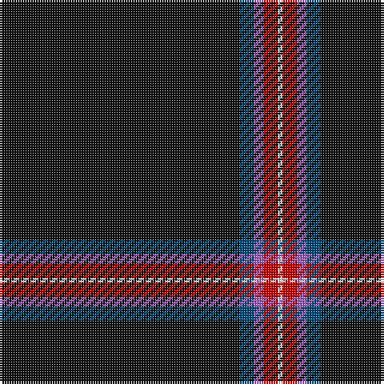

The parent of this is [Fettes (Personal)](/tartans/k/100/db6/lp4/r6/ln/2/)

This was sourced from tartans-authority.  It is a [5 stripes tartan](/stripes/stripes5/).

Original link http://www.tartansauthority.com/tartan-ferret/display/7565/

## Thread count
K/100 DB6 LP4 R6 LN/2

## Palette
Each colour and its ΔE from the base-6 reference it is a variant of.

| Colour | Shade | Base | ΔE (OKLab) |
|---|---|---|---|
| DB |  `#004878` | B  | 0.04 |
| K |  `#101010` | K  | 0.17 |
| LN |  `#E0E0E0` | W  | 0.06 |
| LP |  `#A060BC` | B  | 0.23 |
| R |  `#C80000` | R  | 0.00 |

# Sample pattern

ID: /variants/k/100/db6/lp4/r6/ln/2-db004878-k101010-lne0e0e0-lpa060bc-rc80000/
