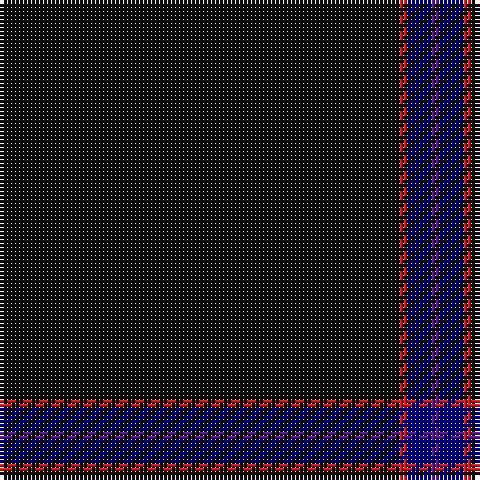

The parent of this is [Alich (Personal)](/tartans/k/100/r2/db6/p/2/)

This was sourced from register-of-tartans.  It is a [4 stripes tartan](/stripes/stripes4/).

Original link https://www.tartanregister.gov.uk/tartanDetails.aspx?ref=10130

## Thread count
K/100 R2 DB6 P/2

## Palette
Each colour and its ΔE from the base-6 reference it is a variant of.

| Colour | Shade | Base | ΔE (OKLab) |
|---|---|---|---|
| DB |  `#000080` | B  | 0.14 |
| K |  `#101010` | K  | 0.17 |
| P |  `#551A8B` | B  | 0.10 |
| R |  `#D41A1F` | R  | 0.03 |

# Sample pattern

ID: /variants/k/100/r2/db6/p/2-db000080-k101010-p551a8b-rd41a1f/
