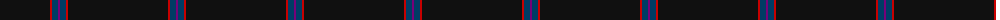
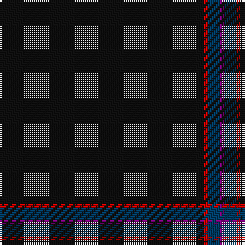

The parent of this is [Alich Dutch Personal Tartan Tartan Number: 10130. Earliest known date: 23rd Nov. 2009 This tartan is for the use of the families of Dirk Alich and his brothers Robert and Carsten. The almost black of the tartan represents the secrets the Alich family is hiding. The red lines represent the bloodlines and the fights that have been won. See products available Copyright © Blair Urquhart, Comrie, 2015](/tartans/k/100/r2/db6/p/2/)

This was sourced from house-of-tartan.  It is a [4 stripes tartan](/stripes/stripes4/).

Original link http://www.house-of-tartan.scotland.net/house/TartanViewjs.asp?colr=Def&tnam=10130

## Thread count
K/100 R2 DB6 P/2

## Palette
Each colour and its ΔE from the base-6 reference it is a variant of.

| Colour | Shade | Base | ΔE (OKLab) |
|---|---|---|---|
| DB |  `#003C64` | B  | 0.07 |
| K |  `#101010` | K  | 0.17 |
| P |  `#780078` | B  | 0.16 |
| R |  `#C80000` | R  | 0.00 |

# Sample pattern

ID: /variants/k/100/r2/db6/p/2-db003c64-k101010-p780078-rc80000/
