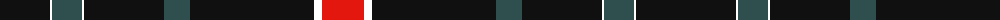

The parent of this is [Provincewide HOG Chapter](/tartans/k/100/w2/n30/w2/k80/n26/k124/w8/r/42/)

This was sourced from register-of-tartans.  It is a [9 stripes tartan](/stripes/stripes9/).

Original link https://www.tartanregister.gov.uk/tartanDetails.aspx?ref=6009

## Thread count
K/100 W2 N30 W2 K80 N26 K124 W8 R/42

## Palette
Each colour and its ΔE from the base-6 reference it is a variant of.

| Colour | Shade | Base | ΔE (OKLab) |
|---|---|---|---|
| K |  `#101010` | K  | 0.17 |
| N |  `#2F4F4F` | B  | 0.11 |
| R |  `#E3170D` | R  | 0.06 |
| W |  `#FFFFFF` | W  | 0.03 |

ID: /variants/k/100/w2/n30/w2/k80/n26/k124/w8/r/42-k101010-n2f4f4f-re3170d-wffffff/
