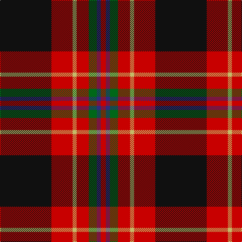

The parent of this is [Tott (Personal))](/tartans/k/102/r42/lg8/r24/g16/db8/r/10/)

This was sourced from tartans-authority.  It is a [7 stripes tartan](/stripes/stripes7/).

Original link http://www.tartansauthority.com/tartan-ferret/display/10770/

## Thread count
K/102 R42 LG8 R24 G16 DB8 R/10

## Palette
Each colour and its ΔE from the base-6 reference it is a variant of.

| Colour | Shade | Base | ΔE (OKLab) |
|---|---|---|---|
| DB |  `#2C2C80` | B  | 0.05 |
| G |  `#006818` | G  | 0.02 |
| K |  `#101010` | K  | 0.17 |
| LG |  `#C4BC68` | Y  | 0.07 |
| R |  `#C80000` | R  | 0.00 |

# Sample pattern

ID: /variants/k/102/r42/lg8/r24/g16/db8/r/10-db2c2c80-g006818-k101010-lgc4bc68-rc80000/
