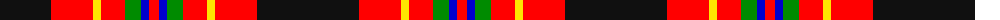

The parent of this is [Totté (from Hofstade de Baerebeeck) (Personal)](/tartans/k/102/r42/y8/r24/g16/b8/r/10/)

This was sourced from register-of-tartans.  It is a [7 stripes tartan](/stripes/stripes7/).

Original link https://www.tartanregister.gov.uk/tartanDetails.aspx?ref=10770

## Thread count
K/102 R42 Y8 R24 G16 B8 R/10

## Palette
Each colour and its ΔE from the base-6 reference it is a variant of.

| Colour | Shade | Base | ΔE (OKLab) |
|---|---|---|---|
| B |  `#0000CD` | B  | 0.15 |
| G |  `#008B00` | G  | 0.12 |
| K |  `#101010` | K  | 0.17 |
| R |  `#FF0000` | R  | 0.11 |
| Y |  `#FFE600` | Y  | 0.10 |

# Sample pattern

ID: /variants/k/102/r42/y8/r24/g16/b8/r/10-b0000cd-g008b00-k101010-rff0000-yffe600/
