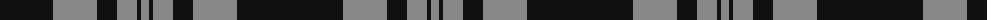
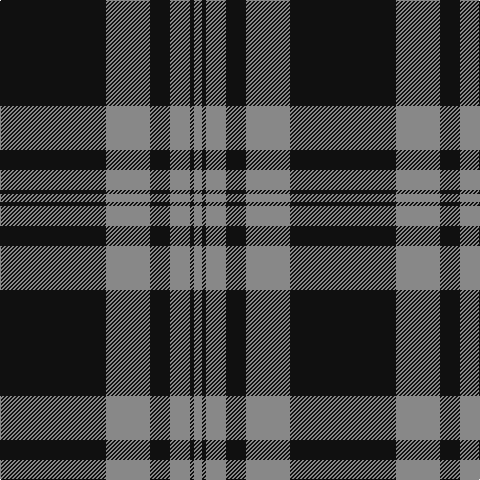

The parent of this is [Black Isle (Corporate)](/tartans/k/106/n44/k20/n20/k4/n/8/)

This was sourced from tartans-authority.  It is a [6 stripes tartan](/stripes/stripes6/).

Original link http://www.tartansauthority.com/tartan-ferret/display/6183/

## Thread count
K/106 N44 K20 N20 K4 N/8

## Palette
Each colour and its ΔE from the base-6 reference it is a variant of.

| Colour | Shade | Base | ΔE (OKLab) |
|---|---|---|---|
| K |  `#101010` | K  | 0.17 |
| N |  `#888888` | R  | 0.24 |

# Sample pattern

ID: /variants/k/106/n44/k20/n20/k4/n/8-k101010-n888888/
