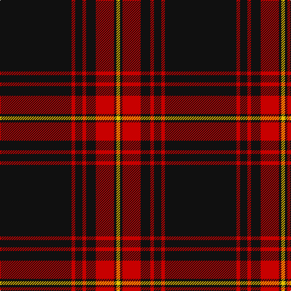

The parent of this is [Royal Army PTC Assoc. (Military)](/tartans/k/118/r6/k12/r6/k16/r30/k4/y/6/)

This was sourced from tartans-authority.  It is a [8 stripes tartan](/stripes/stripes8/).

Original link http://www.tartansauthority.com/tartan-ferret/display/10603/

## Thread count
K/118 R6 K12 R6 K16 R30 K4 Y/6

## Palette
Each colour and its ΔE from the base-6 reference it is a variant of.

| Colour | Shade | Base | ΔE (OKLab) |
|---|---|---|---|
| K |  `#101010` | K  | 0.17 |
| R |  `#C80000` | R  | 0.00 |
| Y |  `#E8C000` | Y  | 0.00 |

# Sample pattern

ID: /variants/k/118/r6/k12/r6/k16/r30/k4/y/6-k101010-rc80000-ye8c000/
