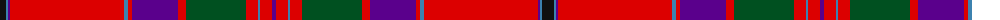

The parent of this is [MacGillivray #2](/tartans/k/12/b2/p2/r114/b4/r4/p46/r8/g60/r12/b2/r12/p/4/)

This was sourced from register-of-tartans.  It is a [13 stripes tartan](/stripes/stripes13/).

Original link https://www.tartanregister.gov.uk/tartanDetails.aspx?ref=2441

## Thread count
K/12 B2 P2 R114 B4 R4 P46 R8 G60 R12 B2 R12 P/4

## Palette
Each colour and its ΔE from the base-6 reference it is a variant of.

| Colour | Shade | Base | ΔE (OKLab) |
|---|---|---|---|
| B |  `#3C82AF` | B  | 0.20 |
| G |  `#005020` | G  | 0.08 |
| K |  `#101010` | K  | 0.17 |
| P |  `#5A008C` | B  | 0.12 |
| R |  `#DC0000` | R  | 0.04 |

ID: /variants/k/12/b2/p2/r114/b4/r4/p46/r8/g60/r12/b2/r12/p/4-b3c82af-g005020-k101010-p5a008c-rdc0000/
