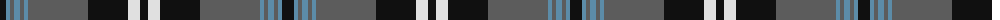

The parent of this is [Nunavut (District)](/tartans/k/12/b4/n4/b6/n4/b4/n60/k40/ln12/k/8/)

This was sourced from tartans-authority.  It is a [10 stripes tartan](/stripes/stripes10/).

Original link http://www.tartansauthority.com/tartan-ferret/display/7730/

## Thread count
K/12 B4 N4 B6 N4 B4 N60 K40 LN12 K/8

## Palette
Each colour and its ΔE from the base-6 reference it is a variant of.

| Colour | Shade | Base | ΔE (OKLab) |
|---|---|---|---|
| B |  `#5C8CA8` | B  | 0.23 |
| K |  `#101010` | K  | 0.17 |
| LN |  `#E0E0E0` | W  | 0.06 |
| N |  `#5C5C5C` | B  | 0.14 |

ID: /variants/k/12/b4/n4/b6/n4/b4/n60/k40/ln12/k/8-b5c8ca8-k101010-lne0e0e0-n5c5c5c/
