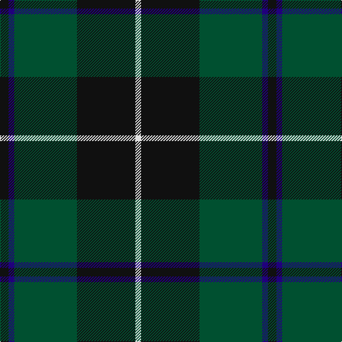

The parent of this is [Douglas (Clan)](/tartans/k/12/db8/g88/k82/ln/8/)

This was sourced from tartans-authority.  It is a [5 stripes tartan](/stripes/stripes5/).

Original link http://www.tartansauthority.com/tartan-ferret/display/1032/

## Thread count
K/12 DB8 G88 K82 LN/8

## Palette
Each colour and its ΔE from the base-6 reference it is a variant of.

| Colour | Shade | Base | ΔE (OKLab) |
|---|---|---|---|
| DB |  `#20007C` | B  | 0.13 |
| G |  `#005030` | G  | 0.09 |
| K |  `#101010` | K  | 0.17 |
| LN |  `#E0E0E0` | W  | 0.06 |

# Sample pattern

ID: /variants/k/12/db8/g88/k82/ln/8-db20007c-g005030-k101010-lne0e0e0/
