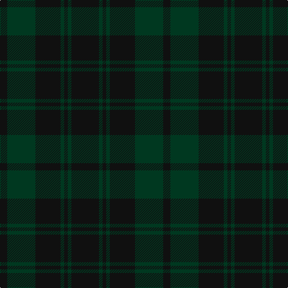

The parent of this is [Taiheiyo Club, Inc (warp)](/tartans/k/12/dg47/k42/dg6/k6/dg6/k/46/)

This was sourced from tartans-authority.  It is a [7 stripes tartan](/stripes/stripes7/).

Original link http://www.tartansauthority.com/tartan-ferret/display/11210/

## Thread count
K/12 DG47 K42 DG6 K6 DG6 K/46

## Palette
Each colour and its ΔE from the base-6 reference it is a variant of.

| Colour | Shade | Base | ΔE (OKLab) |
|---|---|---|---|
| DG |  `#003820` | G  | 0.16 |
| K |  `#101010` | K  | 0.17 |

# Sample pattern

ID: /variants/k/12/dg47/k42/dg6/k6/dg6/k/46-dg003820-k101010/
