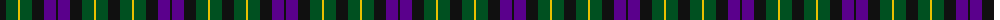
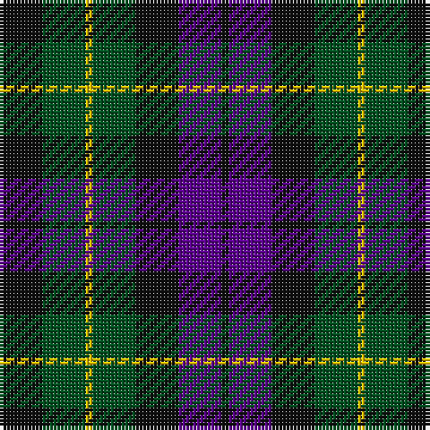

The parent of this is [Abercrombie (Wilsons No 2/64)](/tartans/k/12/g12/y2/g12/k12/p12/k/2/)

This was sourced from register-of-tartans.  It is a [7 stripes tartan](/stripes/stripes7/).

Original link https://www.tartanregister.gov.uk/tartanDetails.aspx?ref=12

## Thread count
K/12 G12 Y2 G12 K12 P12 K/2

## Palette
Each colour and its ΔE from the base-6 reference it is a variant of.

| Colour | Shade | Base | ΔE (OKLab) |
|---|---|---|---|
| G |  `#005020` | G  | 0.08 |
| K |  `#101010` | K  | 0.17 |
| P |  `#5A008C` | B  | 0.12 |
| Y |  `#E8C000` | Y  | 0.00 |

# Sample pattern

ID: /variants/k/12/g12/y2/g12/k12/p12/k/2-g005020-k101010-p5a008c-ye8c000/
