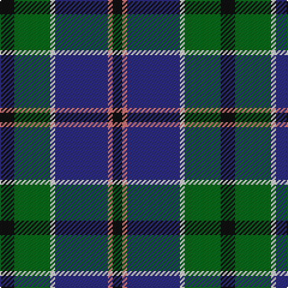

The parent of this is [Leslie, Hebridean (Clan?)](/tartans/k/12/g30/ln4/db44/lr4/k/8/)

This was sourced from tartans-authority.  It is a [6 stripes tartan](/stripes/stripes6/).

Original link http://www.tartansauthority.com/tartan-ferret/display/1111/

## Thread count
K/12 G30 LN4 DB44 LR4 K/8

## Palette
Each colour and its ΔE from the base-6 reference it is a variant of.

| Colour | Shade | Base | ΔE (OKLab) |
|---|---|---|---|
| DB |  `#2C2C80` | B  | 0.05 |
| G |  `#006818` | G  | 0.02 |
| K |  `#101010` | K  | 0.17 |
| LN |  `#E0E0E0` | W  | 0.06 |
| LR |  `#E87878` | R  | 0.19 |

# Sample pattern

ID: /variants/k/12/g30/ln4/db44/lr4/k/8-db2c2c80-g006818-k101010-lne0e0e0-lre87878/
