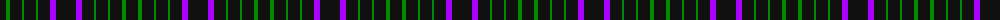

The parent of this is [GOLF (Wonderland Publications) Corporate Tartan Tartan Number: 10698. Earliest known date: 13 September 2012 This tartan was created for the designers’ limited edition publication, GOLF, a registered trademark of Wonderland Publications, a division of Bad Halo Ltd. The tartan is intended to capture the soul and the spirit of the book - and the game. See products available Copyright © Blair Urquhart, Comrie, 2015](/tartans/k/12/g4/k12/g2/k12/g2/k12/p6/k/20/)

This was sourced from house-of-tartan.  It is a [9 stripes tartan](/stripes/stripes9/).

Original link http://www.house-of-tartan.scotland.net/house/TartanViewjs.asp?colr=Def&tnam=10698

## Thread count
K/12 G4 K12 G2 K12 G2 K12 P6 K/20

## Palette
Each colour and its ΔE from the base-6 reference it is a variant of.

| Colour | Shade | Base | ΔE (OKLab) |
|---|---|---|---|
| G |  `#008B00` | G  | 0.12 |
| K |  `#101010` | K  | 0.17 |
| P |  `#AA00FF` | B  | 0.29 |

ID: /variants/k/12/g4/k12/g2/k12/g2/k12/p6/k/20-g008b00-k101010-paa00ff/
