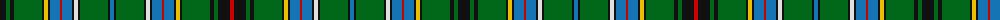

The parent of this is [Duncan of Sketraw Clan Tartan Tartan Number: 6497. Earliest known date: 2005 January A modified version of an unidentified tartan No. 331 from the 1930s. This new version is for John Duncan of Sketraw, and is approved by the Clan Duncan Society See products available Copyright © Blair Urquhart, Comrie, 2015](/tartans/k/12/g4/k4/g28/k2/y4/k2/ba10/r2/ba10/k2/ln4/k2/g28/k2/ba4/k2/g28/k2/ln4/k2/ba10/r2/ba10/k2/y4/k2/g28/k4/g4/k12/r/4/)

This was sourced from house-of-tartan.  It is a [32 stripes tartan](/stripes/stripes32/).

Original link http://www.house-of-tartan.scotland.net/house/TartanViewjs.asp?colr=Def&tnam=6497

## Thread count
K/12 G4 K4 G28 K2 Y4 K2 Ba10 R2 Ba10 K2 LN4 K2 G28 K2 Ba4 K2 G28 K2 LN4 K2 Ba10 R2 Ba10 K2 Y4 K2 G28 K4 G4 K12 R/4

## Palette
Each colour and its ΔE from the base-6 reference it is a variant of.

| Colour | Shade | Base | ΔE (OKLab) |
|---|---|---|---|
| B |  `#2888C4` | B  | 0.21 |
| Ba |  `#1474B4` | B  | 0.15 |
| DB |  `#2C2C80` | B  | 0.05 |
| G |  `#006818` | G  | 0.02 |
| K |  `#101010` | K  | 0.17 |
| LN |  `#E0E0E0` | W  | 0.06 |
| R |  `#C80000` | R  | 0.00 |
| Y |  `#E8C000` | Y  | 0.00 |

ID: /variants/k/12/g4/k4/g28/k2/y4/k2/ba10/r2/ba10/k2/ln4/k2/g28/k2/ba4/k2/g28/k2/ln4/k2/ba10/r2/ba10/k2/y4/k2/g28/k4/g4/k12/r/4-b2888c4-ba1474b4-db2c2c80-g006818-k101010-lne0e0e0-rc80000-ye8c000/
