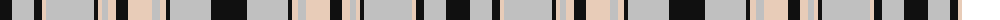

The parent of this is [Abergaveny (Fashion)](/tartans/k/12/k6/n16/n6/k4/k4/lra4/n48/k4/lr4/n6/lra4/lr4/k12/lra24/n8/lr6/k4/n33/n8/k/36/)

This was sourced from tartans-authority.  It is a [21 stripes tartan](/stripes/stripes21/).

Original link http://www.tartansauthority.com/tartan-ferret/display/3013/

## Thread count
K/12 K6 N16 N6 K4 K4 LRa4 N48 K4 LR4 N6 LRa4 LR4 K12 LRa24 N8 LR6 K4 N33 N8 K/36

## Palette
Each colour and its ΔE from the base-6 reference it is a variant of.

| Colour | Shade | Base | ΔE (OKLab) |
|---|---|---|---|
| K |  `#101010` | K  | 0.17 |
| LR |  `#E8CCB8` | W  | 0.11 |
| LRa |  `#E8CCB8` | W  | 0.11 |
| N |  `#C0C0C0` | W  | 0.16 |

ID: /variants/k/12/k6/n16/n6/k4/k4/lra4/n48/k4/lr4/n6/lra4/lr4/k12/lra24/n8/lr6/k4/n33/n8/k/36-k101010-lre8ccb8-lrae8ccb8-nc0c0c0/
