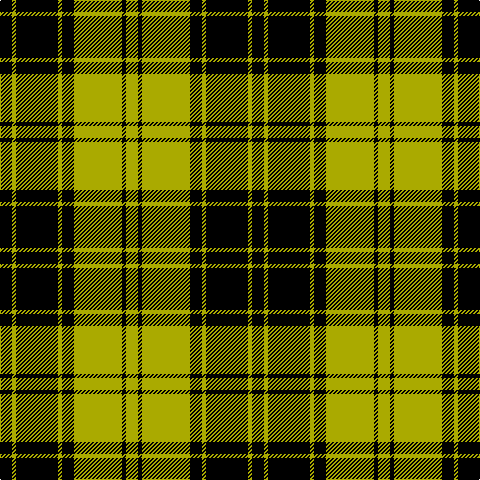

The parent of this is [MacLachlan VS](/tartans/k/12/lg4/k42/lg4/k12/lg48/k4/lg/12/)

This was sourced from weddslist.  It is a [8 stripes tartan](/stripes/stripes8/).

Original link http://www.weddslist.com/cgi-bin/tartans/pg.pl?source=tinsel

## Thread count
K/12 LG4 K42 LG4 K12 LG48 K4 LG/12

## Palette
Each colour and its ΔE from the base-6 reference it is a variant of.

| Colour | Shade | Base | ΔE (OKLab) |
|---|---|---|---|
| K |  `#000000` | K  | 0.00 |
| LG |  `#AAAA00` | Y  | 0.11 |

# Sample pattern

ID: /variants/k/12/lg4/k42/lg4/k12/lg48/k4/lg/12-k000000-lgaaaa00/
