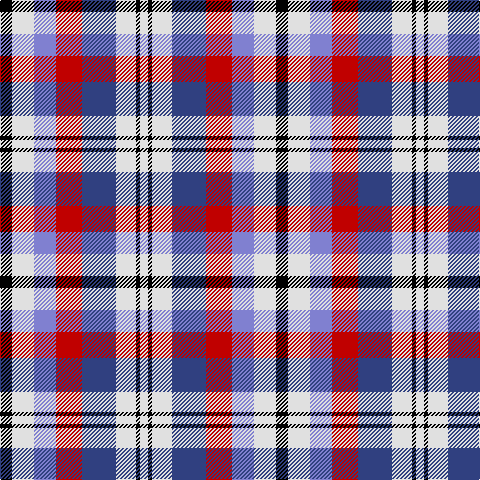

The parent of this is [Edinburgh, Military Tattoo dress](/tartans/k/12/ln22/b22/r26/ba34/ln20/k4/ln/8/)

This was sourced from weddslist.  It is a [8 stripes tartan](/stripes/stripes8/).

Original link http://www.weddslist.com/cgi-bin/tartans/pg.pl?source=sts

## Thread count
K/12 LN22 B22 R26 Ba34 LN20 K4 LN/8

## Palette
Each colour and its ΔE from the base-6 reference it is a variant of.

| Colour | Shade | Base | ΔE (OKLab) |
|---|---|---|---|
| B |  `#8080D0` | B  | 0.24 |
| Ba |  `#304080` | B  | 0.01 |
| K |  `#000000` | K  | 0.00 |
| LN |  `#E0E0E0` | W  | 0.06 |
| R |  `#C00000` | R  | 0.02 |

# Sample pattern

ID: /variants/k/12/ln22/b22/r26/ba34/ln20/k4/ln/8-b8080d0-ba304080-k000000-lne0e0e0-rc00000/
