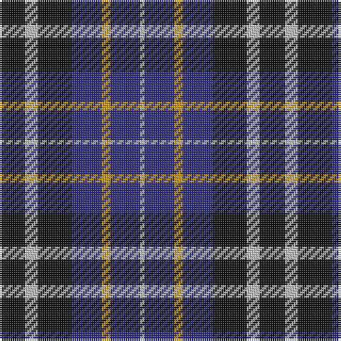

The parent of this is [St. Johnstone F.C. (Sports)](/tartans/k/12/n6/k16/db14/dy4/db14/n/2/)

This was sourced from tartans-authority.  It is a [7 stripes tartan](/stripes/stripes7/).

Original link http://www.tartansauthority.com/tartan-ferret/display/2425/

## Thread count
K/12 N6 K16 DB14 DY4 DB14 N/2

## Palette
Each colour and its ΔE from the base-6 reference it is a variant of.

| Colour | Shade | Base | ΔE (OKLab) |
|---|---|---|---|
| DB |  `#2C2C80` | B  | 0.05 |
| DY |  `#D09800` | Y  | 0.11 |
| K |  `#101010` | K  | 0.17 |
| N |  `#C0C0C0` | W  | 0.16 |

# Sample pattern

ID: /variants/k/12/n6/k16/db14/dy4/db14/n/2-db2c2c80-dyd09800-k101010-nc0c0c0/
