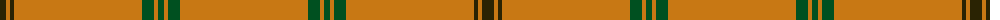

The parent of this is [Connacht (1993)](/tartans/k/12/o4/k4/o128/g12/o4/g6/o4/g12/o/128/)

This was sourced from register-of-tartans.  It is a [10 stripes tartan](/stripes/stripes10/).

Original link https://www.tartanregister.gov.uk/tartanDetails.aspx?ref=739

## Thread count
K/12 O4 K4 O128 G12 O4 G6 O4 G12 O/128

## Palette
Each colour and its ΔE from the base-6 reference it is a variant of.

| Colour | Shade | Base | ΔE (OKLab) |
|---|---|---|---|
| G |  `#005020` | G  | 0.08 |
| K |  `#2A2303` | B  | 0.21 |
| O |  `#C87814` | R  | 0.18 |

ID: /variants/k/12/o4/k4/o128/g12/o4/g6/o4/g12/o/128-g005020-k2a2303-oc87814/
