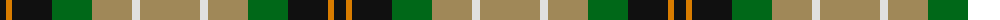

The parent of this is [St. Andrews Bay Hotel (Corporate)](/tartans/k/12/o6/k40/g40/lt40/ln8/lt/60/)

This was sourced from tartans-authority.  It is a [7 stripes tartan](/stripes/stripes7/).

Original link http://www.tartansauthority.com/tartan-ferret/display/5904/

## Thread count
K/12 O6 K40 G40 LT40 LN8 LT/60

## Palette
Each colour and its ΔE from the base-6 reference it is a variant of.

| Colour | Shade | Base | ΔE (OKLab) |
|---|---|---|---|
| G |  `#006818` | G  | 0.02 |
| K |  `#101010` | K  | 0.17 |
| LN |  `#E0E0E0` | W  | 0.06 |
| LT |  `#A08858` | Y  | 0.21 |
| O |  `#D87C00` | Y  | 0.17 |

# Sample pattern

ID: /variants/k/12/o6/k40/g40/lt40/ln8/lt/60-g006818-k101010-lne0e0e0-lta08858-od87c00/
