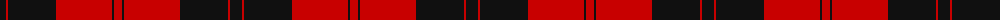

The parent of this is [Aragon (Erskine)](/tartans/k/12/r2/k48/r56/k2/r/8/)

This was sourced from register-of-tartans.  It is a [6 stripes tartan](/stripes/stripes6/).

Original link https://www.tartanregister.gov.uk/tartanDetails.aspx?ref=5281

## Thread count
K/12 R2 K48 R56 K2 R/8

## Palette
Each colour and its ΔE from the base-6 reference it is a variant of.

| Colour | Shade | Base | ΔE (OKLab) |
|---|---|---|---|
| K |  `#101010` | K  | 0.17 |
| R |  `#C80000` | R  | 0.00 |

# Sample pattern

ID: /variants/k/12/r2/k48/r56/k2/r/8-k101010-rc80000/
