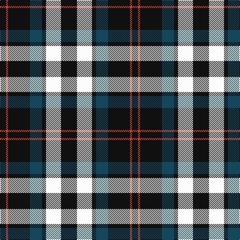

The parent of this is [Sanley-Cantamessa (Personal)](/tartans/k/12/r4/k44/db24/k8/w30/k/32/)

This was sourced from register-of-tartans.  It is a [7 stripes tartan](/stripes/stripes7/).

Original link https://www.tartanregister.gov.uk/tartanDetails.aspx?ref=10854

## Thread count
K/12 R4 K44 DB24 K8 W30 K/32

## Palette
Each colour and its ΔE from the base-6 reference it is a variant of.

| Colour | Shade | Base | ΔE (OKLab) |
|---|---|---|---|
| DB |  `#14465C` | B  | 0.08 |
| K |  `#101010` | K  | 0.17 |
| R |  `#DA412D` | R  | 0.08 |
| W |  `#FCFCFC` | W  | 0.03 |

# Sample pattern

ID: /variants/k/12/r4/k44/db24/k8/w30/k/32-db14465c-k101010-rda412d-wfcfcfc/
