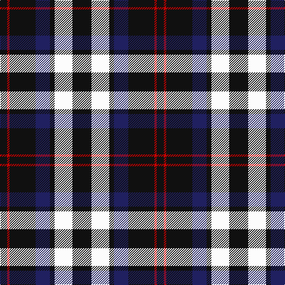

The parent of this is [Sanley-Cantamessa](/tartans/k/12/r4/k44/db24/k8/w30/k/32/)

This was sourced from tartans-authority.  It is a [7 stripes tartan](/stripes/stripes7/).

Original link http://www.tartansauthority.com/tartan-ferret/display/10854/

## Thread count
K/12 R4 K44 DB24 K8 W30 K/32

## Palette
Each colour and its ΔE from the base-6 reference it is a variant of.

| Colour | Shade | Base | ΔE (OKLab) |
|---|---|---|---|
| DB |  `#202060` | B  | 0.11 |
| K |  `#101010` | K  | 0.17 |
| R |  `#C80000` | R  | 0.00 |
| W |  `#FCFCFC` | W  | 0.03 |

# Sample pattern

ID: /variants/k/12/r4/k44/db24/k8/w30/k/32-db202060-k101010-rc80000-wfcfcfc/
