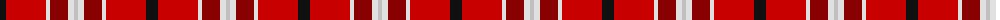

The parent of this is [Thermos Un-named (aretefact)](/tartans/k/12/r40/ln4/dr18/ln6/n/4/)

This was sourced from tartans-authority.  It is a [6 stripes tartan](/stripes/stripes6/).

Original link http://www.tartansauthority.com/tartan-ferret/display/8535/

## Thread count
K/12 R40 LN4 DR18 LN6 N/4

## Palette
Each colour and its ΔE from the base-6 reference it is a variant of.

| Colour | Shade | Base | ΔE (OKLab) |
|---|---|---|---|
| DR |  `#880000` | R  | 0.14 |
| K |  `#101010` | K  | 0.17 |
| LN |  `#E0E0E0` | W  | 0.06 |
| N |  `#C0C0C0` | W  | 0.16 |
| R |  `#C80000` | R  | 0.00 |

# Sample pattern

ID: /variants/k/12/r40/ln4/dr18/ln6/n/4-dr880000-k101010-lne0e0e0-nc0c0c0-rc80000/
