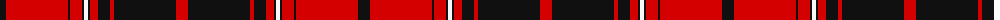

The parent of this is [University of Georgia (Corporate)](/tartans/k/12/r62/k2/r12/k2/w4/k2/r8/k12/r4/k62/r/12/)

This was sourced from tartans-authority.  It is a [12 stripes tartan](/stripes/stripes12/).

Original link http://www.tartansauthority.com/tartan-ferret/display/7688/

## Thread count
K/12 R62 K2 R12 K2 W4 K2 R8 K12 R4 K62 R/12

## Palette
Each colour and its ΔE from the base-6 reference it is a variant of.

| Colour | Shade | Base | ΔE (OKLab) |
|---|---|---|---|
| K |  `#101010` | K  | 0.17 |
| R |  `#D40000` | R  | 0.03 |
| W |  `#F8F8F8` | W  | 0.01 |

ID: /variants/k/12/r62/k2/r12/k2/w4/k2/r8/k12/r4/k62/r/12-k101010-rd40000-wf8f8f8/
