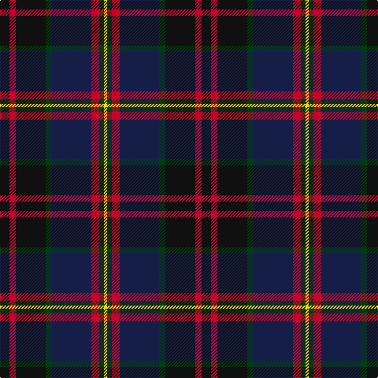

The parent of this is [Bootneck 350](/tartans/k/12/r8/k38/dg8/db50/r10/dg6/y/4/)

This was sourced from register-of-tartans.  It is a [8 stripes tartan](/stripes/stripes8/).

Original link https://www.tartanregister.gov.uk/tartanDetails.aspx?ref=10974

## Thread count
K/12 R8 K38 DG8 DB50 R10 DG6 Y/4

## Palette
Each colour and its ΔE from the base-6 reference it is a variant of.

| Colour | Shade | Base | ΔE (OKLab) |
|---|---|---|---|
| DB |  `#141E46` | B  | 0.15 |
| DG |  `#003C14` | G  | 0.14 |
| K |  `#101010` | K  | 0.17 |
| R |  `#C8002C` | R  | 0.03 |
| Y |  `#FFD700` | Y  | 0.07 |

# Sample pattern

ID: /variants/k/12/r8/k38/dg8/db50/r10/dg6/y/4-db141e46-dg003c14-k101010-rc8002c-yffd700/
