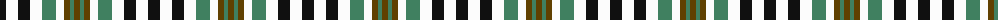

The parent of this is [Burns Heritage Check (Corporate)](/tartans/k/12/w12/k12/w12/g14/w8/t6/g4/t/6/)

This was sourced from tartans-authority.  It is a [9 stripes tartan](/stripes/stripes9/).

Original link http://www.tartansauthority.com/tartan-ferret/display/2206/

## Thread count
K/12 W12 K12 W12 G14 W8 T6 G4 T/6

## Palette
Each colour and its ΔE from the base-6 reference it is a variant of.

| Colour | Shade | Base | ΔE (OKLab) |
|---|---|---|---|
| G |  `#408060` | G  | 0.13 |
| K |  `#101010` | K  | 0.17 |
| T |  `#604000` | G  | 0.14 |
| W |  `#FCFCFC` | W  | 0.03 |

ID: /variants/k/12/w12/k12/w12/g14/w8/t6/g4/t/6-g408060-k101010-t604000-wfcfcfc/
