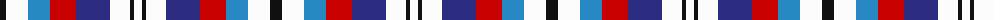

The parent of this is [Edinburgh Tatttoo Dress (Corporate)](/tartans/k/12/w22/b22/r26/db34/w20/k4/w/8/)

This was sourced from tartans-authority.  It is a [8 stripes tartan](/stripes/stripes8/).

Original link http://www.tartansauthority.com/tartan-ferret/display/1223/

## Thread count
K/12 W22 B22 R26 DB34 W20 K4 W/8

## Palette
Each colour and its ΔE from the base-6 reference it is a variant of.

| Colour | Shade | Base | ΔE (OKLab) |
|---|---|---|---|
| B |  `#2888C4` | B  | 0.21 |
| DB |  `#2C2C80` | B  | 0.05 |
| K |  `#101010` | K  | 0.17 |
| R |  `#C80000` | R  | 0.00 |
| W |  `#FCFCFC` | W  | 0.03 |

# Sample pattern

ID: /variants/k/12/w22/b22/r26/db34/w20/k4/w/8-b2888c4-db2c2c80-k101010-rc80000-wfcfcfc/
