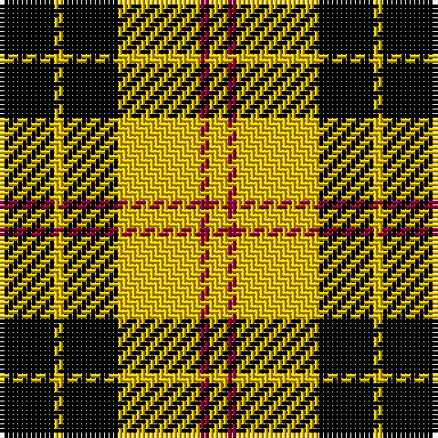

The parent of this is [MacLeod](/tartans/k/12/y2/k12/y18/dr2/y/4/)

This was sourced from weddslist.  It is a [6 stripes tartan](/stripes/stripes6/).

Original link http://www.weddslist.com/cgi-bin/tartans/pg.pl?source=sts

## Thread count
K/12 Y2 K12 Y18 DR2 Y/4

## Palette
Each colour and its ΔE from the base-6 reference it is a variant of.

| Colour | Shade | Base | ΔE (OKLab) |
|---|---|---|---|
| DR |  `#900030` | R  | 0.13 |
| K |  `#000000` | K  | 0.00 |
| Y |  `#F0C000` | Y  | 0.01 |

# Sample pattern

ID: /variants/k/12/y2/k12/y18/dr2/y/4-dr900030-k000000-yf0c000/
