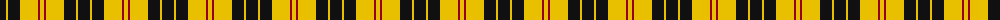

The parent of this is [MacLeod #3](/tartans/k/12/y2/k12/y18/dr2/y/4/)

This was sourced from register-of-tartans.  It is a [6 stripes tartan](/stripes/stripes6/).

Original link https://www.tartanregister.gov.uk/tartanDetails.aspx?ref=2628

## Thread count
K/12 Y2 K12 Y18 DR2 Y/4

## Palette
Each colour and its ΔE from the base-6 reference it is a variant of.

| Colour | Shade | Base | ΔE (OKLab) |
|---|---|---|---|
| DR |  `#960028` | R  | 0.11 |
| K |  `#101010` | K  | 0.17 |
| Y |  `#E8C000` | Y  | 0.00 |

# Sample pattern

ID: /variants/k/12/y2/k12/y18/dr2/y/4-dr960028-k101010-ye8c000/
