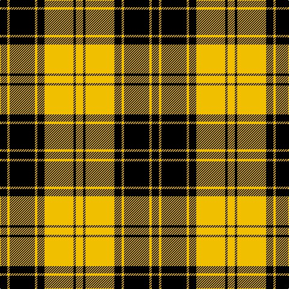

The parent of this is [MacLachlan 4](/tartans/k/12/y4/k42/y4/k12/y48/k4/y/12/)

This was sourced from weddslist.  It is a [8 stripes tartan](/stripes/stripes8/).

Original link http://www.weddslist.com/cgi-bin/tartans/pg.pl?source=sts

## Thread count
K/12 Y4 K42 Y4 K12 Y48 K4 Y/12

## Palette
Each colour and its ΔE from the base-6 reference it is a variant of.

| Colour | Shade | Base | ΔE (OKLab) |
|---|---|---|---|
| K |  `#000000` | K  | 0.00 |
| Y |  `#F0C000` | Y  | 0.01 |

# Sample pattern

ID: /variants/k/12/y4/k42/y4/k12/y48/k4/y/12-k000000-yf0c000/
