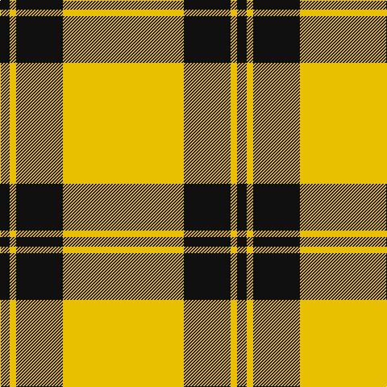

The parent of this is [Perry Ancient (Personal)](/tartans/k/12/y8/ka6/ka52/y/150/)

This was sourced from tartans-authority.  It is a [5 stripes tartan](/stripes/stripes5/).

Original link http://www.tartansauthority.com/tartan-ferret/display/1213/

## Thread count
K/12 Y8 Ka6 Ka52 Y/150

## Palette
Each colour and its ΔE from the base-6 reference it is a variant of.

| Colour | Shade | Base | ΔE (OKLab) |
|---|---|---|---|
| K |  `#101010` | K  | 0.17 |
| Ka |  `#101010` | K  | 0.17 |
| Y |  `#E8C000` | Y  | 0.00 |

# Sample pattern

ID: /variants/k/12/y8/ka6/ka52/y/150-k101010-ka101010-ye8c000/
