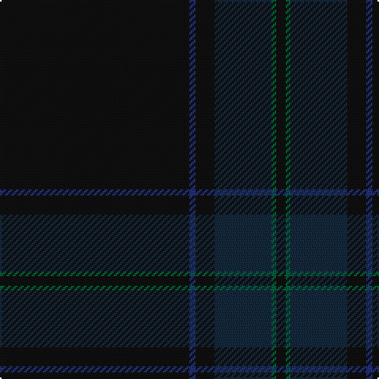

The parent of this is [Scottish Football Association (Corp)](/tartans/k/120/db4/k12/dn36/g3/k/6/)

This was sourced from tartans-authority.  It is a [6 stripes tartan](/stripes/stripes6/).

Original link http://www.tartansauthority.com/tartan-ferret/display/6582/

## Thread count
K/120 DB4 K12 DN36 G3 K/6

## Palette
Each colour and its ΔE from the base-6 reference it is a variant of.

| Colour | Shade | Base | ΔE (OKLab) |
|---|---|---|---|
| DB |  `#203078` | B  | 0.05 |
| DN |  `#14283C` | B  | 0.14 |
| G |  `#006038` | G  | 0.06 |
| K |  `#101010` | K  | 0.17 |

# Sample pattern

ID: /variants/k/120/db4/k12/dn36/g3/k/6-db203078-dn14283c-g006038-k101010/
