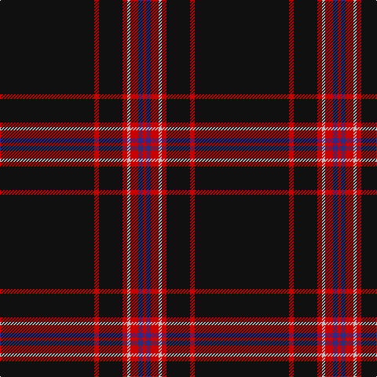

The parent of this is [Whitaker (2014)](/tartans/k/120/r6/k30/r6/n4/r10/db6/r/4/)

This was sourced from tartans-authority.  It is a [8 stripes tartan](/stripes/stripes8/).

Original link http://www.tartansauthority.com/tartan-ferret/display/11073/

## Thread count
K/120 R6 K30 R6 N4 R10 DB6 R/4

## Palette
Each colour and its ΔE from the base-6 reference it is a variant of.

| Colour | Shade | Base | ΔE (OKLab) |
|---|---|---|---|
| DB |  `#2C2C80` | B  | 0.05 |
| K |  `#101010` | K  | 0.17 |
| N |  `#C0C0C0` | W  | 0.16 |
| R |  `#C80000` | R  | 0.00 |

# Sample pattern

ID: /variants/k/120/r6/k30/r6/n4/r10/db6/r/4-db2c2c80-k101010-nc0c0c0-rc80000/
