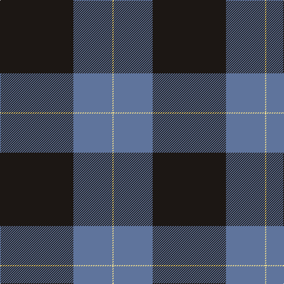

The parent of this is [Westwater (Edinburgh, 2012)](/tartans/k/124/b66/ly/2/)

This was sourced from register-of-tartans.  It is a [3 stripes tartan](/stripes/stripes3/).

Original link https://www.tartanregister.gov.uk/tartanDetails.aspx?ref=10547

## Thread count
K/124 B66 LY/2

## Palette
Each colour and its ΔE from the base-6 reference it is a variant of.

| Colour | Shade | Base | ΔE (OKLab) |
|---|---|---|---|
| B |  `#5F749C` | B  | 0.17 |
| K |  `#1C1714` | K  | 0.21 |
| LY |  `#F8E38C` | Y  | 0.11 |

# Sample pattern

ID: /variants/k/124/b66/ly/2-b5f749c-k1c1714-lyf8e38c/
