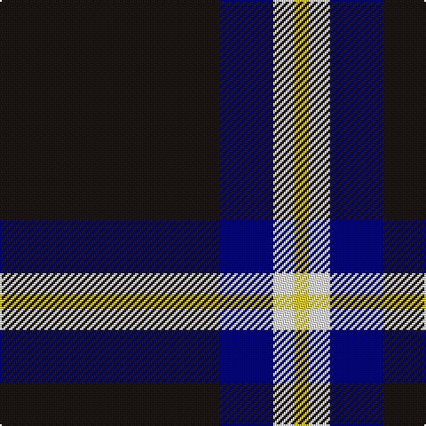

The parent of this is [C-Tec N.I. Ltd](/tartans/k/124/db30/w12/y/8/)

This was sourced from register-of-tartans.  It is a [4 stripes tartan](/stripes/stripes4/).

Original link https://www.tartanregister.gov.uk/tartanDetails.aspx?ref=11419

## Thread count
K/124 DB30 W12 Y/8

## Palette
Each colour and its ΔE from the base-6 reference it is a variant of.

| Colour | Shade | Base | ΔE (OKLab) |
|---|---|---|---|
| DB |  `#000080` | B  | 0.14 |
| K |  `#1C1714` | K  | 0.21 |
| W |  `#F8F8F8` | W  | 0.01 |
| Y |  `#FCCC00` | Y  | 0.04 |

# Sample pattern

ID: /variants/k/124/db30/w12/y/8-db000080-k1c1714-wf8f8f8-yfccc00/
