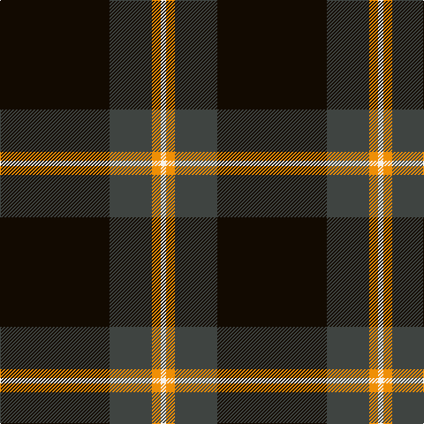

The parent of this is [Perry (Calgary), Alex (Personal)](/tartans/k/124/n48/o10/w/6/)

This was sourced from register-of-tartans.  It is a [4 stripes tartan](/stripes/stripes4/).

Original link https://www.tartanregister.gov.uk/tartanDetails.aspx?ref=10410

## Thread count
K/124 N48 O10 W/6

## Palette
Each colour and its ΔE from the base-6 reference it is a variant of.

| Colour | Shade | Base | ΔE (OKLab) |
|---|---|---|---|
| K |  `#120A01` | K  | 0.15 |
| N |  `#3F4441` | B  | 0.12 |
| O |  `#EF8F06` | Y  | 0.12 |
| W |  `#F7F1E8` | W  | 0.01 |

# Sample pattern

ID: /variants/k/124/n48/o10/w/6-k120a01-n3f4441-oef8f06-wf7f1e8/
