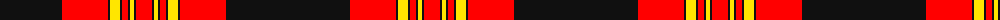

The parent of this is [Burke (Kennesaw), Kevin](/tartans/k/124/r46/k2/y10/k2/r6/k2/y4/k2/r/16/)

This was sourced from register-of-tartans.  It is a [10 stripes tartan](/stripes/stripes10/).

Original link https://www.tartanregister.gov.uk/tartanDetails.aspx?ref=10418

## Thread count
K/124 R46 K2 Y10 K2 R6 K2 Y4 K2 R/16

## Palette
Each colour and its ΔE from the base-6 reference it is a variant of.

| Colour | Shade | Base | ΔE (OKLab) |
|---|---|---|---|
| K |  `#101010` | K  | 0.17 |
| R |  `#FF0000` | R  | 0.11 |
| Y |  `#FFE600` | Y  | 0.10 |

ID: /variants/k/124/r46/k2/y10/k2/r6/k2/y4/k2/r/16-k101010-rff0000-yffe600/
