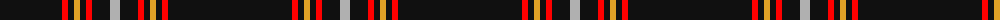
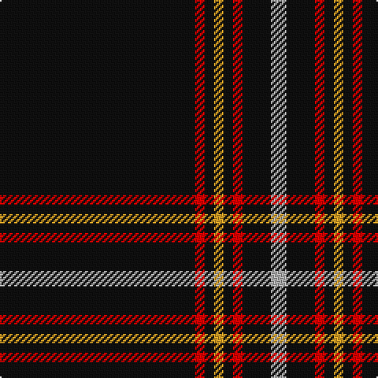

The parent of this is [Auld Bernensis](/tartans/k/124/r6/k6/y6/k6/r6/k18/n/10/)

This was sourced from register-of-tartans.  It is a [8 stripes tartan](/stripes/stripes8/).

Original link https://www.tartanregister.gov.uk/tartanDetails.aspx?ref=10964

## Thread count
K/124 R6 K6 Y6 K6 R6 K18 N/10

## Palette
Each colour and its ΔE from the base-6 reference it is a variant of.

| Colour | Shade | Base | ΔE (OKLab) |
|---|---|---|---|
| K |  `#101010` | K  | 0.17 |
| N |  `#B0B0B0` | Y  | 0.18 |
| R |  `#FF0000` | R  | 0.11 |
| Y |  `#E0A126` | Y  | 0.08 |

# Sample pattern

ID: /variants/k/124/r6/k6/y6/k6/r6/k18/n/10-k101010-nb0b0b0-rff0000-ye0a126/
