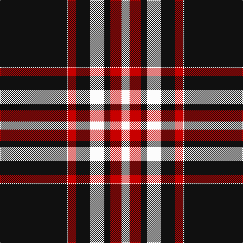

The parent of this is [University of Cincinnati](/tartans/k/132/w2/r16/k28/w28/k12/r22/w/16/)

This was sourced from tartans-authority.  It is a [8 stripes tartan](/stripes/stripes8/).

Original link http://www.tartansauthority.com/tartan-ferret/display/11224/

## Thread count
K/132 W2 R16 K28 W28 K12 R22 W/16

## Palette
Each colour and its ΔE from the base-6 reference it is a variant of.

| Colour | Shade | Base | ΔE (OKLab) |
|---|---|---|---|
| K |  `#101010` | K  | 0.17 |
| R |  `#C80000` | R  | 0.00 |
| W |  `#FCFCFC` | W  | 0.03 |

# Sample pattern

ID: /variants/k/132/w2/r16/k28/w28/k12/r22/w/16-k101010-rc80000-wfcfcfc/
