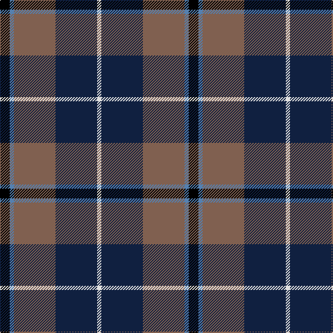

The parent of this is [Douglas, brown](/tartans/k/14/b6/lt60/db60/ln/6/)

This was sourced from weddslist.  It is a [5 stripes tartan](/stripes/stripes5/).

Original link http://www.weddslist.com/cgi-bin/tartans/pg.pl?source=sts

## Thread count
K/14 B6 LT60 DB60 LN/6

## Palette
Each colour and its ΔE from the base-6 reference it is a variant of.

| Colour | Shade | Base | ΔE (OKLab) |
|---|---|---|---|
| B |  `#5480B0` | B  | 0.20 |
| DB |  `#102040` | B  | 0.15 |
| K |  `#000000` | K  | 0.00 |
| LN |  `#E0E0E0` | W  | 0.06 |
| LT |  `#806050` | R  | 0.17 |

# Sample pattern

ID: /variants/k/14/b6/lt60/db60/ln/6-b5480b0-db102040-k000000-lne0e0e0-lt806050/
