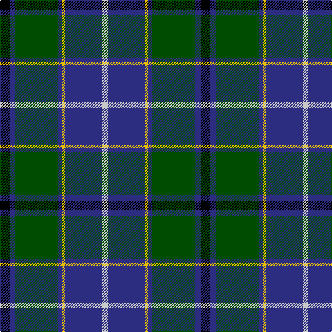

The parent of this is [Wishart Htg (Clan)](/tartans/k/14/db8/g62/db6/y4/db54/n/8/)

This was sourced from tartans-authority.  It is a [7 stripes tartan](/stripes/stripes7/).

Original link http://www.tartansauthority.com/tartan-ferret/display/2105/

## Thread count
K/14 DB8 G62 DB6 Y4 DB54 N/8

## Palette
Each colour and its ΔE from the base-6 reference it is a variant of.

| Colour | Shade | Base | ΔE (OKLab) |
|---|---|---|---|
| DB |  `#2C2C80` | B  | 0.05 |
| G |  `#004C00` | G  | 0.08 |
| K |  `#000000` | K  | 0.00 |
| N |  `#C8C8C8` | W  | 0.13 |
| Y |  `#E8C000` | Y  | 0.00 |

# Sample pattern

ID: /variants/k/14/db8/g62/db6/y4/db54/n/8-db2c2c80-g004c00-k000000-nc8c8c8-ye8c000/
