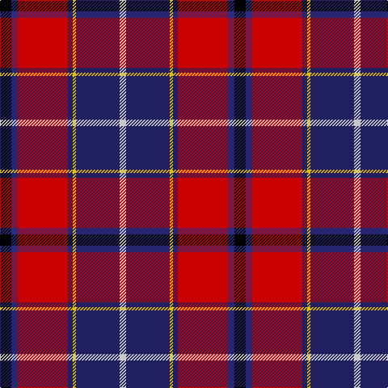

The parent of this is [Wishart Dress (Clan)](/tartans/k/14/db8/r62/dba6/y4/dba54/n/8/)

This was sourced from tartans-authority.  It is a [7 stripes tartan](/stripes/stripes7/).

Original link http://www.tartansauthority.com/tartan-ferret/display/2104/

## Thread count
K/14 DB8 R62 DBa6 Y4 DBa54 N/8

## Palette
Each colour and its ΔE from the base-6 reference it is a variant of.

| Colour | Shade | Base | ΔE (OKLab) |
|---|---|---|---|
| DB |  `#2C2C80` | B  | 0.05 |
| DBa |  `#202060` | B  | 0.11 |
| K |  `#000000` | K  | 0.00 |
| N |  `#C8C8C8` | W  | 0.13 |
| R |  `#C80000` | R  | 0.00 |
| Y |  `#E8C000` | Y  | 0.00 |

# Sample pattern

ID: /variants/k/14/db8/r62/dba6/y4/dba54/n/8-db2c2c80-dba202060-k000000-nc8c8c8-rc80000-ye8c000/
