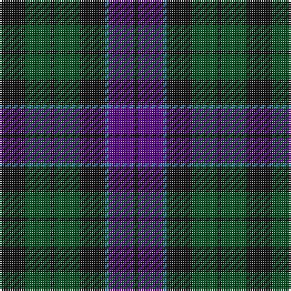

The parent of this is [Wilson's No 108](/tartans/k/14/g14/k2/g14/k14/b2/p14/k/2/)

This was sourced from register-of-tartans.  It is a [8 stripes tartan](/stripes/stripes8/).

Original link https://www.tartanregister.gov.uk/tartanDetails.aspx?ref=4638

## Thread count
K/14 G14 K2 G14 K14 B2 P14 K/2

## Palette
Each colour and its ΔE from the base-6 reference it is a variant of.

| Colour | Shade | Base | ΔE (OKLab) |
|---|---|---|---|
| B |  `#3C82AF` | B  | 0.20 |
| G |  `#005020` | G  | 0.08 |
| K |  `#101010` | K  | 0.17 |
| P |  `#5A008C` | B  | 0.12 |

# Sample pattern

ID: /variants/k/14/g14/k2/g14/k14/b2/p14/k/2-b3c82af-g005020-k101010-p5a008c/
