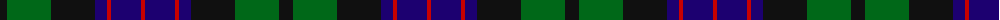

The parent of this is [National Galleries of Scotland (Corp](/tartans/k/14/g44/k44/db12/r4/db30/r/4/)

This was sourced from tartans-authority.  It is a [7 stripes tartan](/stripes/stripes7/).

Original link http://www.tartansauthority.com/tartan-ferret/display/2050/

## Thread count
K/14 G44 K44 DB12 R4 DB30 R/4

## Palette
Each colour and its ΔE from the base-6 reference it is a variant of.

| Colour | Shade | Base | ΔE (OKLab) |
|---|---|---|---|
| DB |  `#1C0070` | B  | 0.14 |
| G |  `#006818` | G  | 0.02 |
| K |  `#101010` | K  | 0.17 |
| R |  `#C80000` | R  | 0.00 |

# Sample pattern

ID: /variants/k/14/g44/k44/db12/r4/db30/r/4-db1c0070-g006818-k101010-rc80000/
