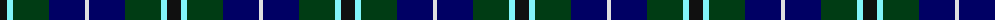

The parent of this is [Bhatti](/tartans/k/14/lb6/dg36/db36/ln/4/)

This was sourced from register-of-tartans.  It is a [5 stripes tartan](/stripes/stripes5/).

Original link https://www.tartanregister.gov.uk/tartanDetails.aspx?ref=5834

## Thread count
K/14 LB6 DG36 DB36 LN/4

## Palette
Each colour and its ΔE from the base-6 reference it is a variant of.

| Colour | Shade | Base | ΔE (OKLab) |
|---|---|---|---|
| DB |  `#000064` | B  | 0.17 |
| DG |  `#003C14` | G  | 0.14 |
| K |  `#101010` | K  | 0.17 |
| LB |  `#82F5FA` | W  | 0.12 |
| LN |  `#E0E0E0` | W  | 0.06 |

# Sample pattern

ID: /variants/k/14/lb6/dg36/db36/ln/4-db000064-dg003c14-k101010-lb82f5fa-lne0e0e0/
